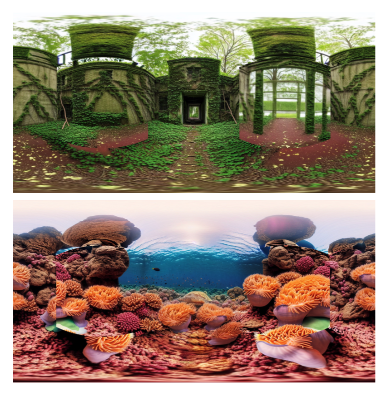

# CubeDiff

Open source implementation of CubeDiff for 360° panorama generation using Stable Diffusion.

**Paper**: [CubeDiff: Repurposing Diffusion-Based Image Models for Panorama Generation](https://arxiv.org/abs/2501.17162) (ICLR 2025)

## About This Implementation

This is the product of a semester project carried out jointly by Hanqiu Li Cai and Juan Tarazona Rodriguez as part of their study program at ETH Zürich. This repository remains an unofficial implementation of the original paper using open-source LDMs and is not affiliated in any shape or form with Google.

## Results

**If you want to directly get started with this repo, head to the [Quick Start guide](#quick-start).**

We will first document the results of the implementation before getting into how you can reproduce them. In summary, the trained checkpoints we make available, using a Stable Diffusion (SD) 1.5 backbone (c.f. [Available Checkpoints](#available-pre-trained-models)), are generally able to create aesthetically pleasing and geometrically consistent panoramas. However, compared CubeDiff's results, the learning seems to be more limited and generation lackluster, with failure cases that will be discussed below. We mainly attribute this limitation to a less potent backbone LDM, given a lower number of parameters and most notably the channel count of the latent space being half of the paper's base model. Here are some examples of good generations:

<p align="center">
  
  
  
</p>

One case of failure is the inability of the model to capture geometric relationship between cube faces. In some generations, most faces are consistent, with the exception of one specific face being completely out of sync. Other instances involve noticeable seams, even having implemented the extra FoV generation from CubeDiff. These types of limitations can be seen here:

<p align="center">

</p>

The second most common case of failure is generation of repetitive patterns, characteristic of diffusion models, which is most evident in a v-prediction backbone (SD2.1). Note that we do not release a v-prediction checkpoint using SD2.1 due to an inferior performance to the SD1.5 models. Reducing the CFG scale relieves this issue, but in turn leads to less geometric consistency in the generation. The scale of such repetitive patterns can range from mild to catastrophic, almost resembling pure noise. These errors are seen here:

<p align="center">

</p>

It is worth noting that such error patterns are far more common in indoor scenes. Finally, we provide a table comparing different captioning methods and backbones to the original CubeDiff paper report, in terms of Frechet and Kernel Incpetion Distance measures (FID, KID, respectively):

<p align="center">

</p>

As can be seen, in line with the corresponding shortcomings of our trained checkpoints, the models perform generally worse across the board when compared to the reported metrics from CubeDiff. We again reiterate that this might mainly be attributed to the weaker baseline model we part from. It is worth noting that the SD2.1 model performs numerically worse than the SD1.5 model. This is caused due to the noisy pattern artifacts shown above, which cause certain perspective renderings to be completely nonsensical and thus artificially worsening the perceptual metrics. On another note, the joint dropping strategy does not seem to have a significant positive impact on the generation quality across the board.

## Quick Start

### Installation

1. **Clone the repository:**
```bash
git clone <repository-url>
cd CubeDiff
```

2. **Create a virtual environment:**
```bash
python -m venv .venv
source .venv/bin/activate  # On Windows: .venv\Scripts\activate
```

3. **Install dependencies:**
```bash
pip install -r requirements.txt
```

### Inference

To run inference, specify the path to your conditioning image and prompts in `inference.py`. 

**Important**: The conditioning image must have a 1:1 aspect ratio for proper conditioning.

#### Text Conditioning Modes

The prompts can be provided in three different formats depending on the model:

1. **Image-only mode** (`imgonly`): Use empty string `""`
2. **Single caption mode** (`singlecaption`): Provide a single string caption
3. **Multi-text mode** (`multitxt`): Provide a list of 6 strings in the order: `[front, back, left, right, top, bottom]`

#### Available Pre-trained Models

| Model | Hugging Face ID | Description |
|-------|----------------|-------------|
| Image-only | `hlicai/cubediff-512-imgonly` | Generates panoramas without text conditioning |
| Single Caption | `hlicai/cubediff-512-singlecaption` | Uses one prompt for all cube faces |
| Multi-text | `hlicai/cubediff-512-multitxt` | Different prompts for each cube face |

#### Example Usage

```python
from cubediff.pipelines.pipeline import CubeDiffPipeline

# Load model from Hugging Face
pipe = CubeDiffPipeline.from_pretrained("hlicai/cubediff-512-singlecaption")

# Single caption example
result = pipe(
    prompts="A beautiful sunset over mountains",
    conditioning_image=your_conditioning_image,
    num_inference_steps=50
)

# Multi-text example  
pipe_multi = CubeDiffPipeline.from_pretrained("hlicai/cubediff-512-multitxt")
result = pipe_multi(
    prompts=[
        "Mountain view",      # front
        "Forest landscape",   # back  
        "Ocean waves",        # left
        "Desert dunes",       # right
        "Cloudy sky",         # top
        "Rocky ground"        # bottom
    ],
    conditioning_image=your_conditioning_image
)
```

### Training

We provide comprehensive training code with single and multi-GPU support via Accelerate.

#### Launch Training

```bash
accelerate launch train.py --config default
```

#### Custom Configurations

You can create additional training configurations in the `training/configs/` folder:

```bash
# Create custom config
cp training/configs/default.yaml training/configs/my_config.yaml

# Launch with custom config (note: no .yaml extension)
accelerate launch train.py --config my_config
```

## Project Organization

```
├── LICENSE                     <- Open-source license
├── README.md                   <- Project documentation  
├── requirements.txt            <- Python dependencies
├── inference.py                <- Main inference script
├── push_to_hub.py             <- Script to deploy models to Hugging Face Hub
├── train.py                   <- Main training script
│
├── ckpts/                     <- Local model checkpoints
│   ├── 512-imageonly/         <- Image-only conditioning model
│   ├── 512-singlecap/         <- Single caption conditioning model
│   └── 512-multitxt/          <- Multi-text conditioning model
│
├── cubediff/                  <- Core CubeDiff implementation
│   ├── modules/               <- Custom neural network modules
│   │   ├── attention.py       <- Custom attention mechanisms
│   │   ├── extra_channels.py  <- Input channel expansion utilities
│   │   ├── norm.py            <- Custom normalization layers
│   │   └── utils.py           <- Utility functions for model patching
│   └── pipelines/             <- Diffusion pipelines
│       ├── pipeline.py        <- Main CubeDiffPipeline implementation
│       └── postprocessing.py  <- Image postprocessing utilities
│
└── training/                  <- Training configurations and utilities
    ├── configs/               <- Training configuration files
    │   └── default.yaml       <- Default training configuration
    └── dataset.py             <- Dataset loading and preprocessing
```

## Requirements

- Python 3.8+
- PyTorch 1.12+
- CUDA-capable GPU (recommended)
- 8GB+ VRAM for inference, 16GB+ for training

## Contributing

1. Fork the repository
2. Create a feature branch (`git checkout -b feature/amazing-feature`)
3. Commit your changes (`git commit -m 'Add amazing feature'`)
4. Push to the branch (`git push origin feature/amazing-feature`)
5. Open a Pull Request

## License

This project is licensed under the terms specified in the LICENSE file.
